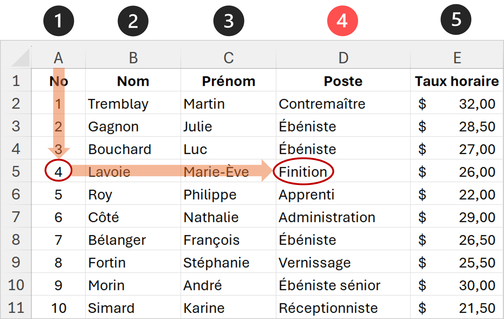

import { Tabs, TabItem, Aside, Steps, Card, CardGrid } from '@astrojs/starlight/components';
import QuizClassification from '../../../components/QuizClassification';
import DataTable from "./../../../components/DataTable.astro";

Jusqu'ici, pour récupérer une valeur dans une feuille ou un tableau, nous faisions référence directement à la celulle cible (contenant la valeur).
Cependant, les choses ne sont pas toujours aussi simple. Parfois tout ce qu'on a comme information, c'est la position relative d'une donnée (valeur),
c'est-à-dire où elle se trouve dans un tableau par rapport à une autre cellule.

C'est là qu'intervient les fonctions de recherche qui offrent un moyen de chercher une valeur dans un tableau à partir d'un critère (une autre valeur se trouvant dans le tableau).

Avant de choisir une fonction, on se posera toujours les questions suivantes :

<CardGrid>
  <Card title="1. Avec quoi cherche-t-on ?">
    La **valeur (clé de recherche)** que tu connais déjà : un numéro d'employé, un code produit, un nom de ville. C'est ton point d'entrée dans le tableau.
  </Card>
  <Card title="2. Où cherche-t-on ?">
    Le **tableau de référence** qui contient la donnée voulue. Il peut être sur la même feuille ou sur une autre feuille du classeur.
  </Card>
  <Card title="3. Comment est organisé le tableau ?">
    La clé de recherche est-elle dans la **première colonne** ? Dans la **première ligne** ? Ailleurs ?
  </Card>
  <Card title="4. Que veut-on récupérer ?">
    La **valeur de retour** : un nom, un prix, une date, un taux. C'est la donnée que la formule doit récupérer.
  </Card>
</CardGrid>

La réponse à ces questions détermine directement la fonction à utiliser :
`RECHERCHEV`, `RECHERCHEH`, `INDEX` + `EQUIV`, `RECHERCHEX`

---

## RECHERCHEV — La recherche verticale

La fonction **RECHERCHEV** permet de récupérer une valeur dans un tableau à partir d’une clé de recherche (valeur connue).
La clé doit se trouver dans la première colonne du tableau, et la valeur à récupérer doit se trouver dans une colonne à droite de cette clé.

### Quand l'utiliser ?

`RECHERCHEV` est le bon choix quand **trois conditions** sont réunies :

1. La clé de recherche se trouve dans la **première colonne** du tableau
2. La valeur de retour se trouve **à droite** de la clé
3. On cherche une **correspondance exacte** ou un barème trié

### Syntaxe

```
=RECHERCHEV(valeur_cherchée; tableau; no_colonne; [correspondance])
```

| Argument | Description |
|---|---|
| `valeur_cherchée` | La valeur clé à trouver dans la première colonne du tableau |
| `tableau` | La plage contenant les données (la clé **doit** être dans la première colonne) |
| `no_colonne` | Le numéro de la colonne à retourner (1 = première colonne du tableau) |
| `correspondance` | `FAUX` = correspondance exacte (**recommandé) **<br/> `VRAI` = correspondance approchée |

<Aside type="caution" title="FAUX presque toujours">
  Utilisez **toujours** `FAUX` sauf si vous faites une recherche par intervalle (barèmes, tranches de prix). 
  Avec `VRAI`, le tableau **doit** être trié en ordre croissant sur la première colonne, sinon les résultats seront imprévisibles.
</Aside>

### Exemple 1 — Fiche rapport de la Menuiserie Abitibi

Soit une **feuille `Employés`** avec les colonnes et données suivantes :

<DataTable
  columns={["No", "Nom", "Prénom", "Poste", "Taux horaire"]}
  rowAlignments={["center",,,,"right"]}
  colSize={100}
  rows={[
    ["1", "Tremblay", "Martin", "Contremaître", "32,00 $"],
    ["2", "Gagnon", "Julie", "Ébéniste", "28,50 $"],
    ["3", "Bouchard", "Luc", "Ébéniste", "27,00 $"],
    ["4", "Lavoie", "Marie-Ève", "Finition", "26,00 $"],
    ["5", "Roy", "Philippe", "Apprenti", "22,00 $"],
    ["6", "Côté", "Nathalie", "Administration", "29,00 $"],
    ["7", "Bélanger", "François", "Ébéniste", "26,50 $"],
    ["8", "Fortin", "Stéphanie", "Vernissage", "25,50 $"],
    ["9", "Morin", "André", "Ébéniste sénior", "30,00 $"],
    ["10", "Simard", "Karine", "Réceptionniste", "21,50 $"],
  ]}
/>

Ici on souhaite récupérer le **poste** de l'employé dont le No est **4**.  

**Pourquoi RECHERCHEV convient ici ?** La clé (numéro d'employé) est dans la **première colonne** du tableau et la valeur de retour (poste) est **à droite**. C'est le cas classique.

Donc si nous sommes dans une **Feuille `Fiche_Rapport`**, où le numéro d'employé sélectionné est inscrit à la cellule B1 (ex: 4), la formule sera :

```
=RECHERCHEV(B1; Employés!A:F; 4; FAUX)
```

> La formule peut être inscrite dans n'importe quelle autre cellule de la feuille `Fiche_Rapport`.



La formule cherche la valeur de B1 (4) dans la colonne A de `Employés` et retourne la valeur de la 4<sup>e</sup> colonne (Poste) : **Finition**.


### Correspondance approchée

Le mode `VRAI` (ou correspondance approchée) est utile pour les **barèmes par tranches**. 
Excel cherche la plus grande valeur **inférieure ou égale** à la valeur cherchée.

#### Exemple — Grille de primes selon l'ancienneté (feuille `Paramètres`)

<DataTable
  columns={["Années minimum", "Prime annuelle"]}
  rowAlignments={["center","right"]}
  colSize={100}
  rows={[
    ["0", "0 $"],
    ["3", "500 $"],
    ["5", "1 000 $"],
    ["10", "2 000 $"],
    ["15", "3 500 $"],
    ["20", "5 000 $"],
  ]}
/>

Ici on souhaite attribuer automatiquement la **prime annuelle** à chaque employé en fonction de son ancienneté (calculée dans la colonne I de la feuille `Employés`).

**Pourquoi le mode approché (`VRAI`) ?** Aucun employé n'a exactement 0, 3, 5, 10… ans d'ancienneté. Un employé avec **7 ans** d'ancienneté doit recevoir la prime de la tranche « 5 ans et plus » (1 000 $), pas une erreur `#N/A`. C'est exactement ce que fait la correspondance approchée : elle cherche la plus grande valeur du barème **qui ne dépasse pas** la valeur réelle.

La formule dans la feuille `Employés`, pour la ligne 2 :

```
=RECHERCHEV(I2; Paramètres!A:B; 2; VRAI)
```

Si l'ancienneté en I2 est **7 ans**, Excel parcourt la colonne A du barème : 0, 3, 5… la prochaine valeur serait 10, qui dépasse 7. Il prend donc la précédente (**5**) et retourne la prime correspondante : **1 000 $**.

<Aside type="caution" title="Tri obligatoire pour VRAI">
  Pour que la correspondance approchée fonctionne, la première colonne **doit être triée en ordre croissant**. Sinon, les résultats seront erronés sans message d'erreur.
</Aside>

### Pièges courants

<Tabs>
  <TabItem label="Erreur #N/A">
    La valeur cherchée n'existe pas dans le tableau. Protégez-vous avec :
    ```
    =SIERREUR(RECHERCHEV(B1; Employés!A:F; 4; FAUX); "Non trouvé")
    ```
  </TabItem>
  <TabItem label="Mauvais no_colonne">
    Le `no_colonne` se compte **à partir du début du tableau**, pas de la feuille. Si votre tableau commence en colonne C, le `no_colonne` 1 correspond à la colonne C.
  </TabItem>
  <TabItem label="Références lors de la copie">
    En copiant la formule vers le bas, la plage du tableau peut glisser. Verrouillez-la avec des références absolues :
    ```
    =RECHERCHEV(B1; Employés!$A$2:$F$11; 4; FAUX)
    ```
  </TabItem>
</Tabs>

### Les limites de RECHERCHEV

Imagine le scénario suivant : un gestionnaire de la *Menuiserie Abitibi* connaît le **nom** d'un employé et veut retrouver son **numéro**. 
Le numéro est en colonne A et le nom en colonne B.

```
=RECHERCHEV("Gagnon"; Employés!B:A; ???; FAUX)    ← IMPOSSIBLE
```

`RECHERCHEV` **ne peut pas faire ça** : elle ne peut chercher dans la colonne B et retourner la colonne A (qui est *à gauche*). On se heurte à la limitation fondamentale.

<Aside type="danger" title="Limitation fondamentale de RECHERCHEV">
  `RECHERCHEV` **ne peut pas chercher vers la gauche**. Si la valeur de retour se trouve *avant* la colonne de recherche, il faut passer à `INDEX`/`EQUIV`.
</Aside>

C'est exactement ce problème qui motive les prochaines sections. Mais avant de le résoudre, voyons d'abord la variante horizontale de `RECHERCHEV` — 
car certains tableaux d'entreprise sont naturellement organisés en lignes plutôt qu'en colonnes.

---

## RECHERCHEH — La recherche horizontale

### Quand l'utiliser ?

`RECHERCHEH` est le miroir de `RECHERCHEV`, orienté à l'horizontale : la valeur clé se trouve dans la **première ligne** 
du tableau et on cherche **vers le bas**. On l'utilise quand les données sont disposées en colonnes plutôt qu'en lignes — ce qui arrive dans les tableaux de **suivi temporel** (heures par jour, ventes par mois, production par semaine).

<Aside type='note' title="Comparaison avec RECHERCHEV">
**RECHERCHEV** effectue une recherche verticale :
la clé est dans la première colonne, et la valeur à récupérer est dans une colonne à droite.

**RECHERCHEH** effectue une recherche horizontale :
la clé est dans la première ligne, et la valeur à récupérer est dans une ligne en dessous.

Autrement dit :

- On utilise RECHERCHEV lorsque les données sont organisées en colonnes (clé à gauche → informations à droite).
- On utilise RECHERCHEH lorsque les données sont organisées en lignes (clé en haut → informations en bas).
</Aside>

### Syntaxe

```
=RECHERCHEH(valeur_cherchée; tableau; no_ligne; [correspondance])
```

| Argument | Description |
|---|---|
| `valeur_cherchée` | La valeur clé à trouver dans la **première ligne** du tableau |
| `tableau` | La plage contenant les données (la clé **doit** être dans la première ligne) |
| `no_ligne` | Le numéro de la ligne à retourner (1 = première ligne du tableau) |
| `correspondance` | `FAUX` = correspondance exacte, `VRAI` = correspondance approchée |

### Exemple 1 — Heures travaillées à la Menuiserie Abitibi

Souvenez-vous de la feuille `Heures_Février` construite dans l'exercice synthèse sur les dates. Ce tableau est naturellement **horizontal** : chaque colonne représente un jour ouvrable, et chaque ligne un employé.

**Feuille `Heures_Février` (extrait) :**

| A — No | B — Nom | 2026-02-02 | 2026-02-03 | 2026-02-04 | 2026-02-05 | 2026-02-06 | ... |
|---|---|---|---|---|---|---|---|
| 1 | Tremblay, Martin | 8 | 8 | 7,5 | 9 | 8 | ... |
| 2 | Gagnon, Julie | 8 | 0 | 8 | 8 | 8 | ... |
| 3 | Bouchard, Luc | 7,5 | 8 | 8 | 8,5 | 7 | ... |
| ... | ... | ... | ... | ... | ... | ... | ... |

Ici, le contremaître veut savoir combien d'heures **Tremblay** a travaillé le **4 février 2026**.

**Pourquoi RECHERCHEH ?** La clé de recherche (la date) se trouve dans la **première ligne** du tableau (les en-têtes de colonnes). Les heures à récupérer sont **en dessous** de cette date. C'est le cas typique d'une recherche horizontale — `RECHERCHEV` ne peut pas parcourir une ligne.

La formule, inscrite par exemple dans une cellule de la feuille `Tableau de bord` :

```
=RECHERCHEH(DATE(2026; 2; 4); Heures_Février!C1:Z3; 2; FAUX)
```

> On utilise `DATE(2026; 2; 4)` plutôt que de taper la date directement pour s'assurer qu'Excel la reconnaît bien comme une date et non comme du texte.

La formule cherche la date du 4 février dans la première ligne (C1:Z1), puis retourne la valeur de la 2<sup>e</sup> ligne du tableau, qui correspond à Tremblay : **7,5 heures**.

Mais attention : le `no_ligne` est ici codé en dur à **2** (Tremblay). Si on veut consulter les heures de **Gagnon**, il faudrait changer manuellement le 2 en 3. Si on veut un employé **variable**, `RECHERCHEH` seule ne suffit pas — c'est `INDEX`/`EQUIV` qui résoudra ce problème (on y reviendra).

### Exemple 2 — Production mensuelle de la Brasserie Boréale

La brasserie *Boréale* à Blainville suit sa production annuelle dans un tableau où les mois sont en colonnes et les types de bière en lignes.

**Feuille `Production_2026` :**

| | Janvier | Février | Mars | Avril | Mai | Juin | ... |
|---|---|---|---|---|---|---|---|
| Blonde d'été | 12 000 | 11 500 | 14 000 | 18 000 | 24 000 | 30 000 | ... |
| IPA du Nord-Est | 8 000 | 8 500 | 9 000 | 10 000 | 12 000 | 14 000 | ... |
| Rousse | 15 000 | 14 000 | 13 500 | 12 000 | 11 000 | 10 000 | ... |
| Noire à l'avoine | 6 000 | 6 500 | 5 500 | 4 000 | 3 000 | 2 500 | ... |

Ici on souhaite connaître la production de **Rousse** au mois d'**avril**.

**Pourquoi RECHERCHEH ?** Les mois sont en **colonnes** (première ligne du tableau) et on veut une valeur **en dessous** du mois trouvé. C'est le même patron que l'exemple précédent — un tableau de suivi temporel classique.

```
=RECHERCHEH("Avril"; Production_2026!A1:M5; 4; FAUX)
```

> Le `no_ligne` est 4 parce que « Rousse » est la 4<sup>e</sup> ligne du tableau (en comptant la ligne d'en-têtes comme ligne 1).

La formule cherche « Avril » dans la première ligne, puis descend jusqu'à la 4<sup>e</sup> ligne (Rousse) et retourne : **12 000** unités.

Encore une fois, le `no_ligne` **4** est codé en dur pour « Rousse ». Si le directeur veut comparer la production de l'**IPA** en avril, il faudrait changer le 4 en 3 manuellement — ou mieux, utiliser `INDEX`/`EQUIV` pour rendre les deux critères dynamiques.

### Correspondance approchée — Barème horizontal

`RECHERCHEH` supporte aussi le mode `VRAI` pour les barèmes orientés horizontalement. Par exemple, un barème de rabais selon le volume commandé :

| 0 | 100 | 500 | 1 000 | 5 000 |
|---|---|---|---|---|
| 0 % | 5 % | 10 % | 15 % | 20 % |

Ici on souhaite trouver le rabais applicable pour une commande de **350 unités**.

```
=RECHERCHEH(350; Rabais!A1:E2; 2; VRAI)
```

La formule cherche 350 dans la première ligne. Puisqu'il n'y a pas de correspondance exacte, Excel prend la plus grande valeur ≤ 350, soit **100**, et retourne le rabais correspondant : **5 %**.

### Les mêmes limites que RECHERCHEV

<Aside type="caution" title="Limites identiques, orientées à l'horizontale">
  `RECHERCHEH` souffre des **mêmes contraintes** que `RECHERCHEV` :
  - Ne cherche que dans la **première ligne** du tableau
  - Ne retourne que **vers le bas** (pas vers le haut)
  - Utilise un **numéro de ligne codé en dur** (fragile si on insère des lignes)

  On a vu dans l'exemple des heures que si on veut choisir dynamiquement *à la fois* la date (colonne) *et* l'employé (ligne), `RECHERCHEH` seule ne suffit pas. C'est `INDEX`/`EQUIV` qui résout ce problème.
</Aside>

---

## INDEX + EQUIV — La combinaison flexible

### Le problème que ça résout

On vient de voir que `RECHERCHEV` et `RECHERCHEH` partagent les mêmes frustrations :
- `RECHERCHEV` ne peut pas chercher **vers la gauche**
- `RECHERCHEH` ne peut pas chercher **vers le haut**
- Les deux utilisent un **numéro codé en dur** (colonne ou ligne) qui casse si on modifie le tableau
- Aucune des deux ne peut croiser **deux critères** dynamiquement (ex. : un employé ET une date)

`INDEX` + `EQUIV` résout **tous** ces problèmes en séparant deux opérations distinctes : *trouver la position* et *aller chercher la valeur*.

### EQUIV — Trouver la position

```
=EQUIV(valeur_cherchée; plage; [type])
```

`EQUIV` ne retourne **pas une valeur**, mais un **numéro de position** — la ligne (ou la colonne) où se trouve la valeur cherchée dans une plage.

| Argument | Description |
|---|---|
| `valeur_cherchée` | Ce qu'on cherche |
| `plage` | Une seule colonne **ou** une seule ligne |
| `type` | `0` = exact, `1` = approché croissant, `-1` = approché décroissant |

```
=EQUIV("Bouchard"; Employés!B2:B11; 0)     → 3  (Bouchard est le 3e nom)
=EQUIV(5; Employés!A2:A11; 0)               → 5  (le numéro 5 est à la 5e position)
```

<Aside type="note" title="Position relative, pas numéro de ligne">
  `EQUIV` retourne la position **dans la plage donnée**, pas le numéro de ligne dans la feuille. Si la plage commence à la ligne 2, la première valeur est à la position 1 (pas 2).
</Aside>

### INDEX — Aller chercher par position

```
=INDEX(plage; no_ligne; [no_colonne])
```

`INDEX` retourne la **valeur** située à une position précise dans une plage.

```
=INDEX(Employés!D2:D11; 3)      → "Ébéniste"  (3e valeur de la colonne Poste)
=INDEX(Employés!C2:C11; 1)      → "Martin"    (1er prénom de la liste)
```

### La combinaison — INDEX(plage_retour; EQUIV(...))

En imbriquant `EQUIV` dans `INDEX`, on obtient un mécanisme de recherche complet :

```
=INDEX(plage_retour; EQUIV(valeur_cherchée; plage_recherche; 0))
```

**En français :** « Va chercher la valeur dans `plage_retour`, à la position où `valeur_cherchée` se trouve dans `plage_recherche`. »

L'élément clé : la `plage_retour` et la `plage_recherche` sont **complètement indépendantes**. Elles peuvent être dans des colonnes différentes, des feuilles différentes, et dans n'importe quel ordre.

---

### Exemple 1 — Recherche vers la gauche (impossible avec RECHERCHEV)

Reprenons le problème qui bloquait `RECHERCHEV` : un gestionnaire de la *Menuiserie Abitibi* connaît le **nom** d'un employé et veut retrouver son **numéro**.

**Feuille `Employés` :**

| A — No | B — Nom | C — Prénom | D — Poste | E — Taux horaire |
|---|---|---|---|---|
| 1 | Tremblay | Martin | Contremaître | 32,00 $ |
| 2 | Gagnon | Julie | Ébéniste | 28,50 $ |
| 3 | Bouchard | Luc | Ébéniste | 27,00 $ |
| 4 | Lavoie | Marie-Ève | Finition | 26,00 $ |
| ... | ... | ... | ... | ... |

Ici on souhaite retrouver le **numéro d'employé** (colonne A) à partir du nom « Gagnon » (colonne B).

**Pourquoi INDEX/EQUIV ?** La clé de recherche (le nom) est dans la colonne B, mais la valeur à retourner (le numéro) est dans la colonne A — c'est-à-dire **à gauche**. `RECHERCHEV` ne peut pas faire ça. Avec `INDEX`/`EQUIV`, la plage de recherche et la plage de retour sont indépendantes.

```
=INDEX(Employés!A2:A11; EQUIV("Gagnon"; Employés!B2:B11; 0))
```

> La formule peut être inscrite dans n'importe quelle feuille du classeur. On pourrait remplacer `"Gagnon"` par une référence de cellule (ex : `F1`) pour rendre la recherche dynamique.

**Décomposition pas à pas :**
1. `EQUIV("Gagnon"; Employés!B2:B11; 0)` → cherche « Gagnon » dans la colonne B → le trouve à la position **2**
2. `INDEX(Employés!A2:A11; 2)` → va chercher la 2<sup>e</sup> valeur de la colonne A → **2** (le numéro d'employé)

Résultat : la formule retourne **2**, le numéro de Julie Gagnon.

<Tabs>
  <TabItem label="Avec RECHERCHEV">
    ```
    =RECHERCHEV("Gagnon"; Employés!B:A; ???; FAUX)
    ```
    **IMPOSSIBLE** — RECHERCHEV ne cherche que dans la première colonne du tableau et retourne uniquement vers la droite. Puisque la colonne A est *avant* la colonne B, il n'y a aucun moyen de l'atteindre.
  </TabItem>
  <TabItem label="Avec INDEX/EQUIV">
    ```
    =INDEX(Employés!A2:A11; EQUIV("Gagnon"; Employés!B2:B11; 0))
    ```
    Fonctionne — la plage de recherche (colonne B) et la plage de retour (colonne A) sont complètement indépendantes. Aucune contrainte de direction.
  </TabItem>
</Tabs>

---

### Exemple 2 — Résistance à l'insertion de colonnes

Chez *Transport Lacroix* de Rouyn-Noranda, le tableau du personnel est structuré ainsi :

| A — Code | B — Nom | C — Département | D — Téléphone |
|---|---|---|---|
| TRN-ADM-001 | Tremblay, Sophie | Administration | 819-555-1234 |
| TRN-ENT-002 | Gagnon, Marc | Entretien | 819-555-5678 |
| TRN-ADM-003 | Bouchard, Émilie | Administration | 819-555-9012 |
| ... | ... | ... | ... |

Ici on souhaite retrouver le **numéro de téléphone** de l'employé `TRN-ADM-001`.

**Le problème avec RECHERCHEV :** la formule `=RECHERCHEV("TRN-ADM-001"; Personnel!A:D; 4; FAUX)` fonctionne — le `4` pointe vers la colonne D (Téléphone). Mais imaginez que quelqu'un insère une colonne « Courriel » entre C et D. Le téléphone passe en colonne **E**, mais le `4` codé en dur ne change pas. La formule retourne maintenant le **courriel** au lieu du téléphone, **sans aucun message d'erreur**.

**Pourquoi INDEX/EQUIV est plus robuste :** la formule pointe directement sur la **colonne** D par son nom, pas par un numéro.

```
=INDEX(Personnel!D:D; EQUIV("TRN-ADM-001"; Personnel!A:A; 0))
```

> Même si on insère des colonnes avant D, Excel ajuste automatiquement la référence `D:D`. La formule ne casse jamais.

**Décomposition :**
1. `EQUIV("TRN-ADM-001"; Personnel!A:A; 0)` → trouve le code à la position **1**
2. `INDEX(Personnel!D:D; 1)` → retourne la 1<sup>re</sup> valeur de la colonne D : **819-555-1234**

<Aside type="tip" title="Robustesse dans les vrais classeurs">
  Dans un classeur d'entreprise qui évolue avec le temps (ajout de colonnes, réorganisation), `INDEX`/`EQUIV` est beaucoup plus fiable que `RECHERCHEV` parce qu'elle ne dépend pas d'un numéro de colonne codé en dur. C'est particulièrement important quand plusieurs personnes travaillent sur le même classeur.
</Aside>

---

### Exemple 3 — Résoudre le problème de RECHERCHEH (Heures_Février)

Souvenez-vous du problème soulevé dans la section `RECHERCHEH` : on pouvait trouver les heures de Tremblay pour une date donnée, mais le numéro de ligne était **codé en dur** à 2. Si le contremaître veut choisir *à la fois* l'employé et la date, `RECHERCHEH` seule ne suffit pas.

**Feuille `Heures_Février` (extrait) :**

| A — No | B — Nom | 2026-02-02 | 2026-02-03 | 2026-02-04 | 2026-02-05 | ... |
|---|---|---|---|---|---|---|
| 1 | Tremblay, Martin | 8 | 8 | 7,5 | 9 | ... |
| 2 | Gagnon, Julie | 8 | 0 | 8 | 8 | ... |
| 3 | Bouchard, Luc | 7,5 | 8 | 8 | 8,5 | ... |

Ici on souhaite retrouver les heures travaillées par **Gagnon** (employé no **2**) le **4 février 2026**, en rendant les deux critères **dynamiques**.

**Pourquoi INDEX/EQUIV ?** On a besoin de croiser un critère vertical (l'employé, dans les lignes) et un critère horizontal (la date, dans les colonnes). C'est une **recherche bidimensionnelle** — ni `RECHERCHEV` ni `RECHERCHEH` ne peuvent gérer les deux critères dynamiquement en même temps.

Dans une feuille `Tableau de bord`, avec le numéro d'employé en B1 (ex : **2**) et la date en B2 (ex : **2026-02-04**) :

```
=INDEX(
  Heures_Février!C2:Z11;
  EQUIV(B1; Heures_Février!A2:A11; 0);
  EQUIV(B2; Heures_Février!C1:Z1; 0)
)
```

> `INDEX` reçoit ici **deux positions** : une pour la ligne (l'employé) et une pour la colonne (la date). C'est la forme bidimensionnelle de `INDEX`.

**Décomposition :**
1. `EQUIV(B1; A2:A11; 0)` → cherche le numéro d'employé **2** dans la colonne A → position **2** (Gagnon)
2. `EQUIV(B2; C1:Z1; 0)` → cherche la date **2026-02-04** dans la première ligne → position **3** (3<sup>e</sup> colonne de dates)
3. `INDEX(C2:Z11; 2; 3)` → va au croisement de la 2<sup>e</sup> ligne et de la 3<sup>e</sup> colonne → **8** heures

En changeant B1 ou B2, le résultat se met à jour automatiquement. Le contremaître peut consulter les heures de n'importe quel employé, n'importe quel jour, sans modifier la formule.

<Tabs>
  <TabItem label="Avec RECHERCHEH seule">
    ```
    =RECHERCHEH(DATE(2026;2;4); Heures_Février!C1:Z4; 3; FAUX)
    ```
    Le numéro de ligne `3` est codé en dur pour Gagnon. Pour consulter Bouchard, il faudrait changer le 3 en 4 manuellement.
  </TabItem>
  <TabItem label="Avec INDEX/EQUIV">
    ```
    =INDEX(C2:Z11;
      EQUIV(B1; A2:A11; 0);
      EQUIV(B2; C1:Z1; 0))
    ```
    L'employé ET la date sont dynamiques — on change B1 ou B2 et le résultat se met à jour.
  </TabItem>
</Tabs>

C'est un cas de **recherche bidimensionnelle** : on croise un critère vertical (l'employé) et un critère horizontal (la date). Voyons un autre exemple de ce patron puissant.

---

### Exemple 4 — Recherche bidimensionnelle (grille de prix)

Les tableaux à double entrée sont très courants en entreprise : grilles tarifaires, horaires, budgets. `INDEX`/`EQUIV` est la **seule** combinaison classique qui les gère dynamiquement.

**Grille de prix de la fromagerie *Les Têtes Fromagères* (Warwick) :**

| | 200 g | 400 g | 1 kg | Meule (2 kg) |
|---|---|---|---|---|
| Cheddar vieilli | 7,99 $ | 13,99 $ | 29,99 $ | 52,99 $ |
| Brie double crème | 9,49 $ | 16,99 $ | 34,99 $ | 59,99 $ |
| Bleu bénédictin | 10,99 $ | 18,99 $ | 39,99 $ | 69,99 $ |
| Raclette | 8,99 $ | 15,99 $ | 32,99 $ | 56,99 $ |
| Gouda fumé | 9,99 $ | 17,49 $ | 36,99 $ | 64,99 $ |

Ici on souhaite trouver le prix du **Brie double crème** en format **1 kg**. Le type de fromage détermine la ligne et le format détermine la colonne — c'est un croisement de deux critères.

**Pourquoi INDEX/EQUIV ?** Avec `RECHERCHEV`, on pourrait trouver la ligne du Brie, mais le numéro de colonne pour « 1 kg » serait codé en dur. Avec `RECHERCHEH`, on pourrait trouver la colonne « 1 kg », mais la ligne du Brie serait codée en dur. Seul `INDEX` avec **deux `EQUIV`** rend les **deux** critères dynamiques.

Dans un bon de commande, avec le type de fromage en B1 et le format en B2 :

```
=INDEX(B2:E6; EQUIV(B1; A2:A6; 0); EQUIV(B2; B1:E1; 0))
```

> `INDEX` reçoit deux positions : le 2<sup>e</sup> argument est le numéro de ligne (trouvé par le premier `EQUIV`) et le 3<sup>e</sup> argument est le numéro de colonne (trouvé par le deuxième `EQUIV`).

**Décomposition :**
1. `EQUIV("Brie double crème"; A2:A6; 0)` → « Brie double crème » est la 2<sup>e</sup> valeur → position **2**
2. `EQUIV("1 kg"; B1:E1; 0)` → « 1 kg » est la 3<sup>e</sup> valeur → position **3**
3. `INDEX(B2:E6; 2; 3)` → va au croisement de la 2<sup>e</sup> ligne et de la 3<sup>e</sup> colonne → **34,99 $**

<Tabs>
  <TabItem label="Avec RECHERCHEV">
    ```
    =RECHERCHEV("Brie double crème"; A:E; ???; FAUX)
    ```
    On peut trouver la ligne du Brie, mais le numéro de colonne (3 pour « 1 kg ») est **codé en dur**. Si le client change de format, il faut modifier la formule.
  </TabItem>
  <TabItem label="Avec RECHERCHEH">
    ```
    =RECHERCHEH("1 kg"; A1:E6; ???; FAUX)
    ```
    On peut trouver la colonne « 1 kg », mais le numéro de ligne (3 pour Brie) est **codé en dur**. Si le client change de fromage, il faut modifier la formule.
  </TabItem>
  <TabItem label="Avec INDEX/EQUIV">
    ```
    =INDEX(B2:E6;
      EQUIV("Brie double crème"; A2:A6; 0);
      EQUIV("1 kg"; B1:E1; 0))
    ```
    Les **deux** critères sont dynamiques — on choisit le fromage ET le format, et le prix se met à jour tout seul.
  </TabItem>
</Tabs>

<Aside type="note" title="Le patron est le même">
  Que ce soit les heures d'un employé à une date donnée (Menuiserie Abitibi) ou le prix d'un fromage dans un format donné (Les Têtes Fromagères), le mécanisme est identique : `INDEX(tableau; EQUIV(critère_ligne); EQUIV(critère_colonne))`. Repérez ce patron chaque fois que vous croisez deux critères dans un tableau à double entrée.
</Aside>

---

### Exemple 5 — Tableau de bord multi-feuilles (suivi de classe)

Dans le classeur de suivi de classe vu en début de session, les données sont réparties sur **deux feuilles différentes** : les informations personnelles de l'étudiant dans une feuille, ses notes dans une autre. On veut construire un tableau de bord qui regroupe tout à partir d'un seul code étudiant.

**Feuille `Étudiants` :**

| A — Code | B — Nom | C — Programme |
|---|---|---|
| STU001 | Tremblay, Sophie | Gestion comptable |
| STU002 | Gagnon, Marc | Informatique |
| ... | ... | ... |

**Feuille `Notes` :**

| A — Code | B — Examen 1 | C — Examen 2 | D — Projet |
|---|---|---|---|
| STU001 | 78 | 85 | 92 |
| STU002 | 65 | 72 | 80 |
| ... | ... | ... | ... |

Ici on souhaite afficher toutes les informations de l'étudiant **STU001** dans une seule feuille, en allant chercher les données dans les deux feuilles sources.

**Pourquoi INDEX/EQUIV ?** `RECHERCHEV` fonctionnerait aussi dans ce cas (la clé est en première colonne des deux tableaux). Mais `INDEX`/`EQUIV` est préférable ici pour deux raisons : les formules sont plus lisibles quand on nomme explicitement les plages, et si on réorganise les colonnes dans `Notes`, les formules ne cassent pas.

**Feuille `Tableau de bord`, avec le code étudiant en B1 (ex : STU001) :**

```
Nom :      =INDEX(Étudiants!B:B; EQUIV(B1; Étudiants!A:A; 0))
Programme: =INDEX(Étudiants!C:C; EQUIV(B1; Étudiants!A:A; 0))
Examen 1 : =INDEX(Notes!B:B; EQUIV(B1; Notes!A:A; 0))
Examen 2 : =INDEX(Notes!C:C; EQUIV(B1; Notes!A:A; 0))
Projet :   =INDEX(Notes!D:D; EQUIV(B1; Notes!A:A; 0))
Résultat : =SI(MOYENNE(...)>=60; "Réussite"; "Échec")
```

> Chaque formule utilise le même `EQUIV(B1; ...A:A; 0)` pour trouver la position, mais pointe vers une colonne de retour différente. En changeant la valeur de B1, **toutes** les formules se recalculent automatiquement.

C'est le même principe que la fiche rapport de la *Menuiserie Abitibi* — un classeur **interactif** où l'utilisateur choisit un élément et toute la fiche se met à jour.

---

{/* ### Résumé — Quand choisir INDEX/EQUIV plutôt que RECHERCHEV ou RECHERCHEH ?

| Situation | RECHERCHEV / RECHERCHEH | INDEX/EQUIV |
|---|---|---|
| Cas simple (clé en 1re colonne/ligne, retour à droite/bas) | ✅ Suffisant | ✅ Fonctionne aussi |
| Retour vers la **gauche** ou vers le **haut** | ❌ Impossible | ✅ |
| Tableau à **double entrée** (ex. : employé × date, fromage × format) | ❌ Un seul critère dynamique | ✅ Deux critères dynamiques |
| Résistance à l'**insertion de colonnes/lignes** | ❌ Le numéro codé en dur casse | ✅ Les plages s'ajustent |
| Données sur **plusieurs feuilles** | ⚠️ Fonctionne mais fragile | ✅ Plus lisible avec plages nommées |
| **Performance** sur grands volumes | ⚠️ Parcourt tout le tableau | ✅ Plus rapide (cherche une colonne à la fois) |
| **Simplicité** de la syntaxe | ✅ Une seule fonction | ⚠️ Deux fonctions imbriquées |

<Aside type="note" title="Règle pratique">
  Si le cas est simple (clé en première colonne, retour à droite, petit tableau stable), `RECHERCHEV` reste parfaitement valide. Dès que l'une de ses limites vous bloque, passez à `INDEX`/`EQUIV`.
</Aside>

--- */}

## RECHERCHEX — La recherche moderne

### D'où elle vient

Microsoft a constaté que `RECHERCHEV` était la fonction la plus utilisée d'Excel, mais aussi l'une des plus frustrantes à cause de ses limitations. Plutôt que de demander aux utilisateurs de maîtriser l'imbrication `INDEX`/`EQUIV`, Microsoft a créé `RECHERCHEX` dans Microsoft 365 (et Excel 2021) : une **fonction unique** qui reprend les avantages de `INDEX`/`EQUIV` dans une syntaxe plus directe.

<Aside type="caution" title="Compatibilité">
  `RECHERCHEX` n'est **pas disponible** dans Excel 2019 et les versions antérieures. Si vos classeurs doivent être ouverts par des utilisateurs avec d'anciennes versions, utilisez `INDEX`/`EQUIV` qui fonctionne **partout**.
</Aside>

### Syntaxe

```
=RECHERCHEX(valeur_cherchée; plage_recherche; plage_retour; [si_introuvable]; [correspondance]; [mode_recherche])
```

| Argument | Description |
|---|---|
| `valeur_cherchée` | La valeur clé |
| `plage_recherche` | La colonne (ou ligne) dans laquelle chercher |
| `plage_retour` | La colonne (ou ligne) dont on veut la valeur — **indépendante** de la plage de recherche |
| `si_introuvable` | *(optionnel)* Valeur à retourner si non trouvé (remplace `SIERREUR`) |
| `correspondance` | *(optionnel)* 0 = exacte, -1 = inférieur, 1 = supérieur, **2 = caractères génériques** |
| `mode_recherche` | *(optionnel)* 1 = du début, -1 = de la fin, 2 = binaire croissant, -2 = binaire décroissant |

### Ce qui la distingue des autres

`RECHERCHEX` se positionne comme un **raccourci syntaxique** : elle fait la même chose que `INDEX`/`EQUIV`, mais en une seule fonction. Voici ce qui la rend unique :

<CardGrid>
  <Card title="Argument si_introuvable intégré" icon="approve-check">
    Plus besoin d'envelopper dans `SIERREUR` — le 4e argument gère directement le cas « non trouvé ».
  </Card>
  <Card title="Caractères génériques natifs" icon="magnifier">
    Le 5e argument à `2` permet de chercher avec `*` (n'importe quels caractères) et `?` (un seul caractère) — idéal pour les recherches partielles.
  </Card>
  <Card title="Recherche du dernier" icon="left-arrow">
    Le 6e argument à `-1` cherche **de la fin vers le début** — utile pour trouver la dernière occurrence (dernière commande, dernier paiement).
  </Card>
</CardGrid>

---

### Exemple 1 — Recherche vers la gauche (même cas que INDEX/EQUIV)

Reprenons le même cas : retrouver le numéro d'employé de « Gagnon » chez la *Menuiserie Abitibi*. On cherche dans la colonne B (nom) et on veut la colonne A (numéro) — vers la gauche.

Avec `RECHERCHEX`, la formule est plus directe :

```
=RECHERCHEX("Gagnon"; Employés!B:B; Employés!A:A; "Employé introuvable")
```

> Le 4<sup>e</sup> argument (`"Employé introuvable"`) remplace `SIERREUR` — si le nom n'existe pas, ce message s'affiche au lieu d'une erreur `#N/A`.

La formule cherche « Gagnon » dans la colonne B, le trouve à la 2<sup>e</sup> position, et retourne la valeur correspondante de la colonne A : **2**.

Comparons la syntaxe des deux approches pour le même résultat :

<Tabs>
  <TabItem label="Avec INDEX/EQUIV">
    ```
    =SIERREUR(
      INDEX(Employés!A2:A11; EQUIV("Gagnon"; Employés!B2:B11; 0));
      "Employé introuvable"
    )
    ```
    3 fonctions imbriquées (INDEX + EQUIV + SIERREUR). Fonctionne dans **toutes** les versions d'Excel.
  </TabItem>
  <TabItem label="Avec RECHERCHEX">
    ```
    =RECHERCHEX("Gagnon"; Employés!B:B; Employés!A:A; "Employé introuvable")
    ```
    1 seule fonction, le `si_introuvable` est intégré. Requiert Microsoft 365 ou Excel 2021+.
  </TabItem>
</Tabs>

Les deux retournent le même résultat. `RECHERCHEX` est plus concise, mais `INDEX`/`EQUIV` fonctionne partout.

---

### Exemple 2 — Décodage de codes avec extraction de texte

Chez *Transport Lacroix*, chaque employé a un code comme `TRN-ADM-001`. Le gestionnaire veut afficher le **nom complet du département** à côté de chaque employé, sans le taper manuellement.

On dispose d'une table de correspondance des départements :

| A — Code dept | B — Nom complet | C — Responsable |
|---|---|---|
| ADM | Administration | Côté, Nathalie |
| ENT | Entretien | Fortin, David |
| LOG | Logistique | Roy, Philippe |

Ici on souhaite retrouver le nom du département à partir du code employé `TRN-ADM-001`. Le code du département correspond aux positions **5 à 7** du code complet (« ADM »).

**Pourquoi combiner extraction + recherche ?** Le code employé contient *plusieurs informations encodées* (entreprise, département, numéro). On doit d'abord **extraire** la partie utile avec `STXT`, puis la **chercher** dans la table de correspondance.

```
=RECHERCHEX(STXT(B2; 5; 3); Départements!A:A; Départements!B:B; "Département inconnu")
```

> `STXT(B2; 5; 3)` extrait 3 caractères à partir de la position 5 du code en B2, ce qui donne « ADM ».

**Décomposition :**
1. `STXT("TRN-ADM-001"; 5; 3)` → extrait **"ADM"**
2. `RECHERCHEX("ADM"; Départements!A:A; Départements!B:B; ...)` → cherche « ADM » dans la table → retourne **"Administration"**

<Aside type="tip" title="Patron fréquent : extraction + recherche">
  On **extrait** une portion d'un code avec `GAUCHE`, `DROITE` ou `STXT`, puis on **cherche** cette portion dans une table de référence. Cela transforme un code cryptique en information lisible. Ce patron fonctionne aussi bien avec `INDEX`/`EQUIV` :
  `=INDEX(Départements!B:B; EQUIV(STXT(B2; 5; 3); Départements!A:A; 0))`
</Aside>

---

### Exemple 3 — Caractères génériques (exclusif à RECHERCHEX)

Dans la liste du personnel de *Transport Lacroix*, un gestionnaire tape « Trem » dans une cellule de recherche parce qu'il ne se souvient pas de l'orthographe complète du nom. Il veut quand même trouver le **département** de cet employé.

**Pourquoi RECHERCHEX ici ?** Le 5<sup>e</sup> argument à `2` active les **caractères génériques** : `*` remplace n'importe quel nombre de caractères et `?` remplace exactement un caractère. Cela permet des recherches partielles.

```
=RECHERCHEX("Trem*"; Personnel!B:B; Personnel!C:C; "Non trouvé"; 2)
```

> Le `2` comme 5<sup>e</sup> argument est ce qui active les caractères génériques. Sans lui (ou avec `0`), Excel chercherait littéralement le texte « Trem* » et ne trouverait rien.

La formule cherche le premier nom qui **commence par « Trem »** dans la colonne B, trouve « Tremblay, Sophie », et retourne la valeur correspondante de la colonne C : **Administration**.

<Tabs>
  <TabItem label="Avec INDEX/EQUIV">
    ```
    =INDEX(Personnel!C:C; EQUIV("Trem*"; Personnel!B:B; 0))
    ```
    Fonctionne aussi — `EQUIV` supporte les caractères génériques avec le type `0`. La syntaxe est moins explicite sur le fait qu'on utilise des génériques.
  </TabItem>
  <TabItem label="Avec RECHERCHEX">
    ```
    =RECHERCHEX("Trem*"; Personnel!B:B; Personnel!C:C; "Non trouvé"; 2)
    ```
    Plus explicite — le `2` indique clairement qu'on utilise des caractères génériques, et le `"Non trouvé"` est intégré.
  </TabItem>
</Tabs>

---

### Exemple 4 — Trouver la dernière occurrence (exclusif à RECHERCHEX)

Ici on souhaite trouver le montant de la **dernière commande** passée par le client « Tremblay » dans un registre de commandes. `RECHERCHEV` et `INDEX`/`EQUIV` retournent toujours la **première** correspondance — ce qui donnerait la commande la plus ancienne.

**Registre des commandes de *Outils du Nord* :**

| A — Client | B — Date | C — Montant |
|---|---|---|
| Tremblay | 2026-01-15 | 120 $ |
| Gagnon | 2026-02-03 | 85 $ |
| Tremblay | 2026-03-22 | 200 $ |
| Bouchard | 2026-04-10 | 150 $ |
| Tremblay | 2026-05-08 | 95 $ |

**Pourquoi RECHERCHEX ici ?** Son 6<sup>e</sup> argument permet de chercher **de la fin vers le début** du tableau, ce qui retourne automatiquement la dernière occurrence — une capacité qu'aucune autre fonction de recherche n'offre simplement.

```
=RECHERCHEX("Tremblay"; A:A; C:C; 0; 0; -1)
```

> Le `-1` comme 6<sup>e</sup> argument signifie « chercher de la fin vers le début ». Les deux `0` sont : le 4<sup>e</sup> argument (valeur si non trouvé = 0) et le 5<sup>e</sup> argument (correspondance exacte).

La formule parcourt la colonne A **de bas en haut**, trouve « Tremblay » pour la première fois à la ligne 6 (la commande du 8 mai), et retourne le montant correspondant : **95 $** — pas 120 $ (qui serait la première commande, trouvée par RECHERCHEV).

<Tabs>
  <TabItem label="Avec INDEX/EQUIV">
    Pour trouver la dernière occurrence, il faudrait une formule matricielle complexe :
    ```
    =INDEX(C:C; MAX(SI(A2:A100="Tremblay"; LIGNE(A2:A100); 0)))
    ```
    *(Ctrl+Maj+Entrée)* — beaucoup plus complexe, moins lisible, et nécessite de connaître les formules matricielles.
  </TabItem>
  <TabItem label="Avec RECHERCHEX">
    ```
    =RECHERCHEX("Tremblay"; A:A; C:C; 0; 0; -1)
    ```
    Simple et direct grâce au 6<sup>e</sup> argument. C'est un des rares cas où `RECHERCHEX` fait quelque chose de vraiment plus simple que `INDEX`/`EQUIV`.
  </TabItem>
</Tabs>

---

### Exemple 5 — Correspondance approchée (barème) avec RECHERCHEX

Reprenons la grille de primes par ancienneté vue avec `RECHERCHEV`. On souhaite retrouver la prime pour un employé avec **7 ans** d'ancienneté.

**Pourquoi montrer RECHERCHEX ici ?** Le 5<sup>e</sup> argument `-1` signifie « correspondance exacte, sinon l'élément **inférieur** suivant » — c'est l'équivalent du `VRAI` de `RECHERCHEV`, mais avec une différence importante.

```
=RECHERCHEX(7; Paramètres!A:A; Paramètres!B:B; 0; -1)
```

> Le `-1` comme 5<sup>e</sup> argument cherche d'abord une correspondance exacte. S'il n'en trouve pas, il prend la plus grande valeur **inférieure** à la valeur cherchée.

La formule cherche **7** dans la colonne A des paramètres, ne le trouve pas exactement, prend la plus grande valeur inférieure (c'est **5**) et retourne la prime correspondante : **1 000 $**.

**Différence clé avec RECHERCHEV :** contrairement à `RECHERCHEV(... VRAI)` qui **exige** que les données soient triées en ordre croissant, `RECHERCHEX` avec `-1` fonctionne **peu importe l'ordre** des données. En pratique, c'est quand même une bonne habitude de trier ses barèmes pour la lisibilité.

---


## Résumé des fonctions

| Fonction | Syntaxe simplifiée | Cherche dans | Retourne vers | Disponibilité |
|---|---|---|---|---|
| `RECHERCHEV` | `(clé; tableau; no_col; FAUX)` | 1re colonne | Droite uniquement | Toutes versions |
| `RECHERCHEH` | `(clé; tableau; no_ligne; FAUX)` | 1re ligne | Bas uniquement | Toutes versions |
| `EQUIV` | `(clé; plage; 0)` | 1 colonne ou 1 ligne | **Position** (pas une valeur) | Toutes versions |
| `INDEX` | `(plage; no_ligne; [no_col])` | — | **Valeur** à une position | Toutes versions |
| `INDEX`+`EQUIV` | `INDEX(retour; EQUIV(clé; rech; 0))` | N'importe où | N'importe où | Toutes versions |
| `RECHERCHEX` | `(clé; rech; retour; [erreur])` | N'importe où | N'importe où | Microsoft 365 / 2021+ |
| `SIERREUR` | `(formule; valeur_si_erreur)` | — | — | Excel 2007+ |